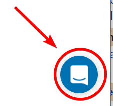

We can  learn you how to develop and manage the life cycle of Cloud Automations [CALM](./docs/calm). Reach out using the Intercommuniator  to get in dialogue.

## Services

- [Rent a test lab](/labs) Convincing your boss, test new features, support internal workshops, check out newest gear on the marked.

## References 

- [hexatown//docs](http://hexatown.com/docs) \(navigates to hexatown.com\) We have founded an Open Source Initiative called "hexatown". The purpose of that is to establish a collection of administrative Usecases , guides, test cases and scripts. 